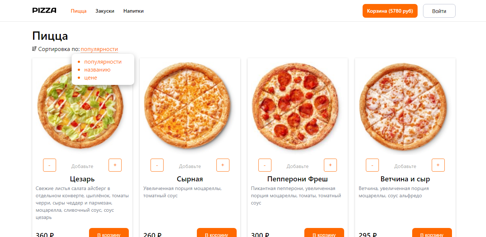
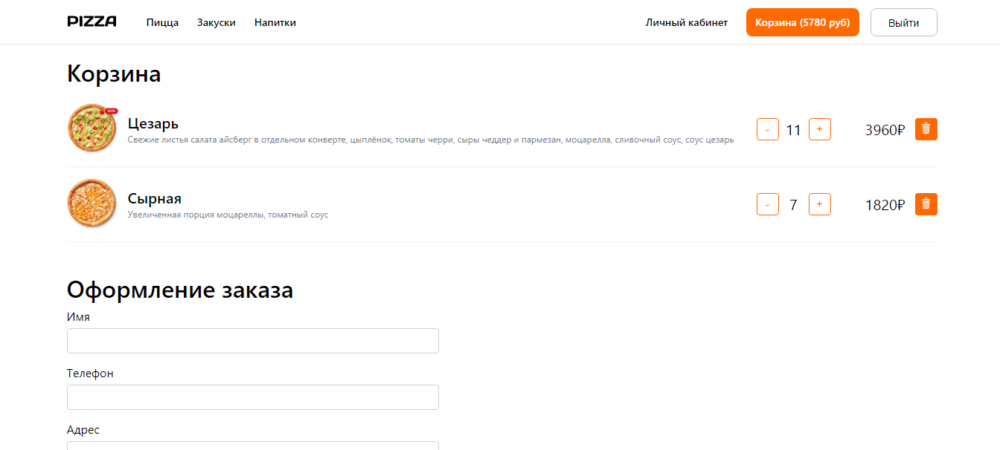
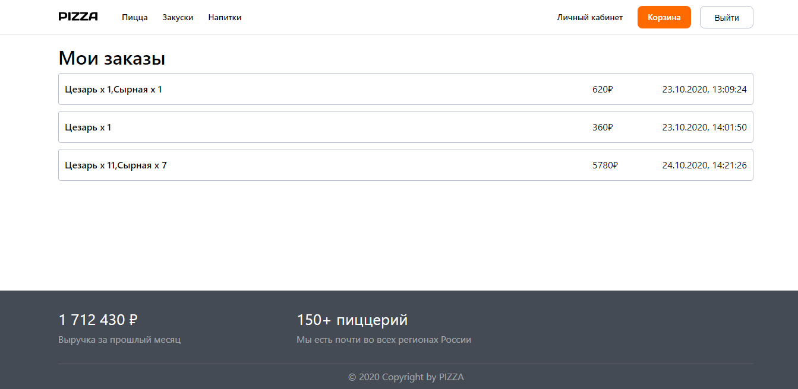

# MERN project + Typescript

Project shop using MERN stack + typescript.

This is the backend repo built with Express + Typescript and MongoDB . Frontend repo [click here](https://github.com/hardsmile98/pizza-client)

## Running Locally

Then run <code>npm run dev</code>

## UI

### Main page

### Cart

### Cabinet

